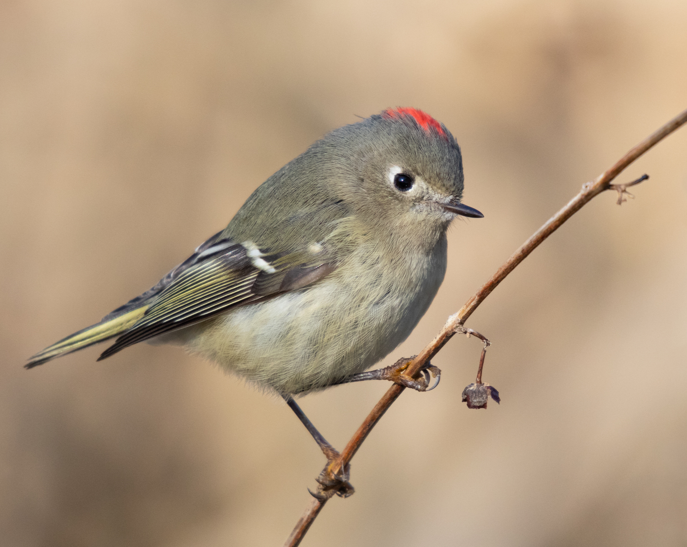
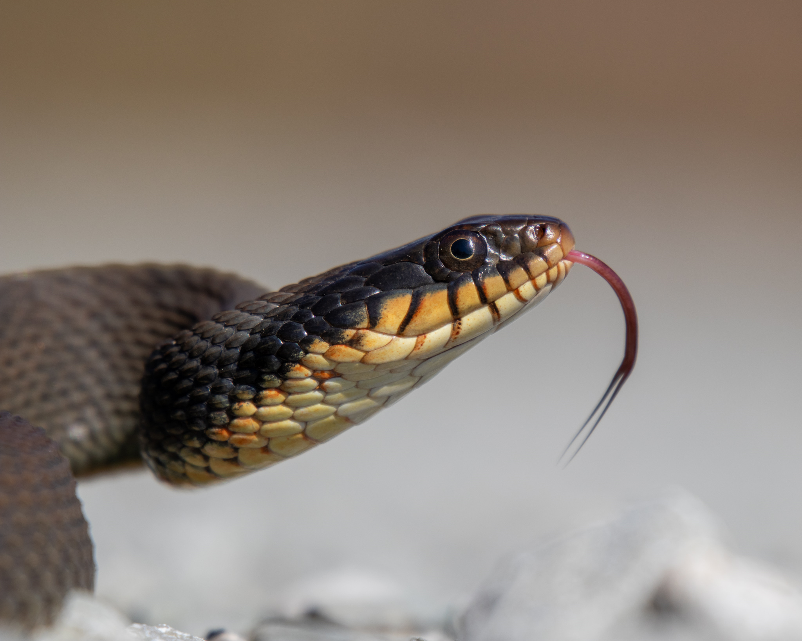

```{r setup, include=FALSE}
library(knitr)
library(htmltools)
```
<html>

<head>
  <title>One Page Website</title>
  <style>
    body {
      font-family: Arial, sans-serif;
      margin: 0;
      padding: 0;
      box-sizing: border-box;
      background-color: white;
    }

    header {
      background-color: darkslateblue;
      color: white;
      padding: 30px;
      text-align: center;
      width: 100%;
      box-sizing: border-box;
    }

    nav {
      display: flex;
      justify-content: space-around;
      background-color: navy;
      padding: 10px;
    }

    nav a {
      color: white;
      text-decoration: none;
      font-weight: bold;
    }

    section {
      padding: 20px;
      text-align: center;
      display: none;
      width: 100%;
      box-sizing: border-box;
      margin-top: 80px;
    }

    footer {
      background-color: darkslateblue;
      color: white;
      text-align: center;
      padding: 10px;
      width: 100%;
      box-sizing: border-box;
    }

    .photo-grid {
      display: grid;
      grid-template-columns: repeat(2, 1fr);
      gap: 20px;
    }

    .photo-grid img {
      width: 100%;
      height: auto;
      border-radius: 8px;
    }
  </style>
</head>

<body>

  <header>
    <h1>Daniel Redwine</h1>
    <h2>Exploring Nature's Beauty</h2>
  </header>

  <nav>
    <a href="#section1">Biology</a>
    <a href="#section2">Programming</a>
    <a href="#section3">Photography</a>
  </nav>

  <section id="section1" style="display: block;">
    <h2>Biology</h2>
    <p>This is the content of the Biology section.</p>
  </section>

  <section id="section2">
    <h2>Programming</h2>
    <p>This is the content of the Programming section.</p>
  </section>

  <section id="section3">
    <h2>Photography</h2>
    <div class="photo-grid">
```{r knitr, echo=FALSE}
      
      
      knitr::include_graphics("../png/lalo.png")
      knitr::include_graphics("../png/eaph.png")
```
    </div>
  </section>

  <footer>
    <p>Contact Information:</p>
    <p>Daniel Redwine<br>
      Austin Peay State University<br>
      Email: <a href="mailto:dredwine@my.apsu.edu">dredwine@my.apsu.edu</a>
    </p>
  </footer>

  <script>
    document.querySelectorAll('a').forEach(anchor => {
      anchor.addEventListener('click', function (e) {
        e.preventDefault();

        // Hide all sections
        document.querySelectorAll('section').forEach(section => {
          section.style.display = 'none';
        });

        // Display the selected section with fade effect
        document.querySelector(this.getAttribute('href')).style.display = 'block';
        fadeIn(document.querySelector(this.getAttribute('href')), 800);
      });
    });

    function fadeIn(element, duration) {
      element.style.opacity = 0;
      var last = +new Date();
      var tick = function () {
        element.style.opacity = +element.style.opacity + (new Date() - last) / duration;
        last = +new Date();

        if (+element.style.opacity < 1) {
          (window.requestAnimationFrame && requestAnimationFrame(tick)) || setTimeout(tick, 16);
        }
      };
      tick();
    }
  </script>

</body>

</html>

